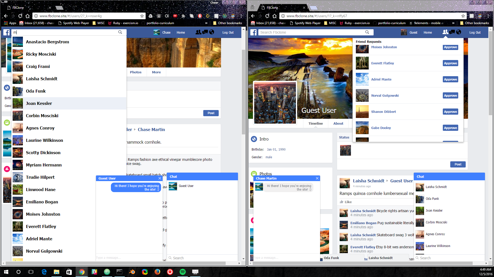
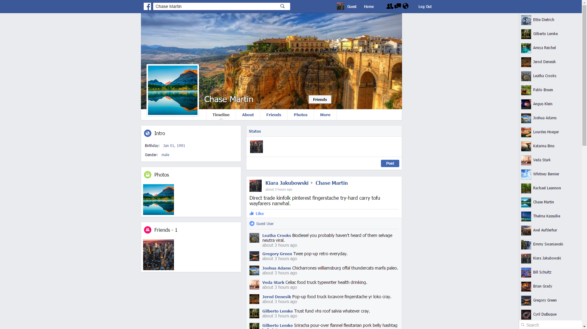
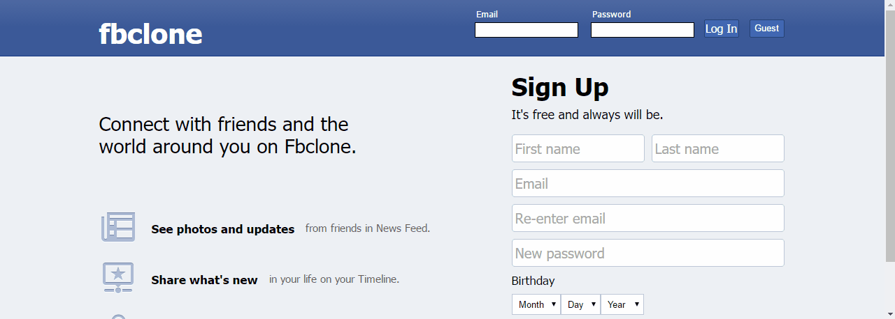
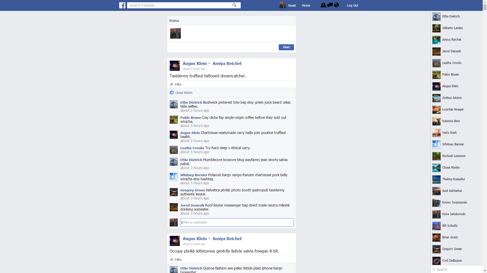
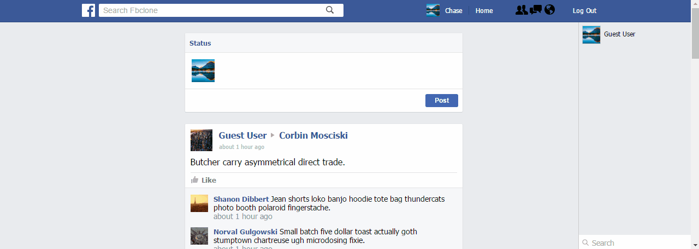
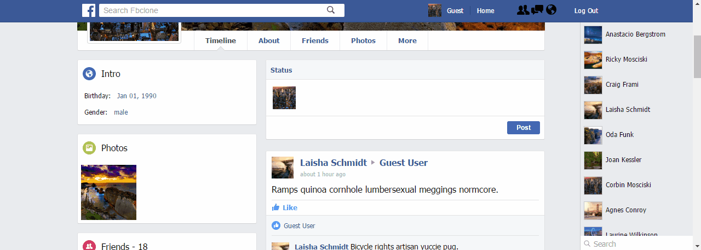
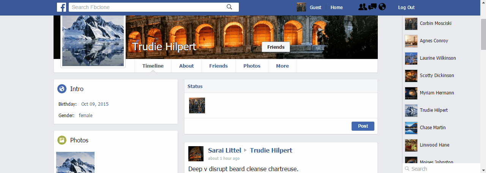

# [Fbclone][fbclone]
[fbclone]: http:fbclone.site


### Description
Fbclone is a social networking platform inspired by Facebook. It implements SPA architecture with a React/Redux frontend and AJAX requests to a JSON API supporting by Rails. User authentication is provided with the BCrypt ruby gem to store salted and hashed passwords. ActiveRecord queries are minimized by fetching all user related data at login with a single query. The live chat feature uses bi-directional functionality via WebSockets with the help of Pusher.

### Features Overview
- [ ] User Authentication
- [ ] Profiles
- [ ] Friending
- [ ] Live Chat
- [ ] Posting
- [ ] Commenting
- [ ] Liking
- [ ] Image Uploading
- [ ] Search



### User Profile Layout
Profile picture, banner image, profile navigation, intro, photos, friends and timeline.



### Guest Login
Allows user to login with guest account to immediately view newsfeed and create comments, posts and likes.



### Account Creation
Provide name, unique email, password(minimum 6 characters), birthday and gender for account credentials and profile info.


### Login
User authentication using BCrypt ruby gem with password salting and digests.


### Newsfeed
Displays all friends' and current user's post. Uses ActiveRecord's ```#include``` method to prefetch all associated post data in one query.
```ruby
class Api::UsersController < ApplicationController
  def show
    @user = User.find(params[:id])
    friend_ids = @user.friends.map { |friend| friend.id }
    friend_ids << @user.id

    @newsfeed_posts = Post
    .includes(
    :author,
    :user,
    { comments: [ { likes: [ :liker ] }, :author ] },
    { likes: [:liker] }
    )
    .where(author_id: friend_ids)
  end
end
```




### Chat Boxes
Expandable and collapsible chat boxes. Open chat box and by clicking on a user in the 'live chat' sidebar.


### Search
Uses a custom 'search' scope defined on the User model to search by first name, last name or email with regular expressions.
```ruby
class User < ActiveRecord::Base
  scope :search, -> (string) {
      select('(first_name || " " || last_name) as \'full_name\', *')
      where(
      'LOWER(email) like LOWER(?)
      OR LOWER(first_name) like LOWER(?)
      OR LOWER(last_name) like LOWER(?)
      OR LOWER(first_name || \' \' || last_name) like LOWER(?)',
      "%#{string}%", "%#{string}%","%#{string}%","%#{string}%") }
end
```


### Accepting Friend Requests
Accept request in 'friend requests' dropdown or directly on user profile and the change will be reflected in both places in real time


### Making Friend Requests
Click 'Add Friend' on a user's profile and they will see your request in their 'friend requests' dropdown.



### Image Uploading
Drag and drop an image file on your own profile picture or background to set a new profile picture or background using ImageMagick for auto-formatting and the Paperclip ruby gem to upload to and store in AWS's S3 service.

```ruby
class Photo < ActiveRecord::Base
  has_attached_file :image, default_url: "seeds/0_:style.jpg", validate_media_type: false,
    styles: { profile_picture: "300x300#", banner:"854x316#"}
  validates_attachment_content_type :image, content_type: /\Aimage\/.*\Z/
  belongs_to :user
end
```


### Bootstrapping Current User
If a user is signed in, ```window.currentUser``` is set to the result of a jbuilder partial which returns all user related data. This prevents screen flickering from Ajax requests after a page reload.
```html+erb
<script id="bootstrap-current-user" type="text/javascript">
  <% if logged_in? %>
  	window.currentUser = <%=
      render(
        "api/users/bootstrap.json.jbuilder",
        locals: {
          user: @user,
          timeline_posts: @timeline_posts,
          newsfeed_posts: @newsfeed_posts
        }
      ).html_safe
    %>
  <% end %>
</script>

<main id="root"></main>
```



### Real-time Feedback
One example of real-time feedback is the instant addition of a user in the live chat sidebar upon accepting their request.




### Upcoming Features
- [ ] Extended live features(see other users' activity in real-time)
- [ ] Provide link preview if link included in post
- [ ] Notifications
- [ ] Comment replies
- [ ] Comment likes
- [ ] Posting pictures
- [ ] Privacy settings
